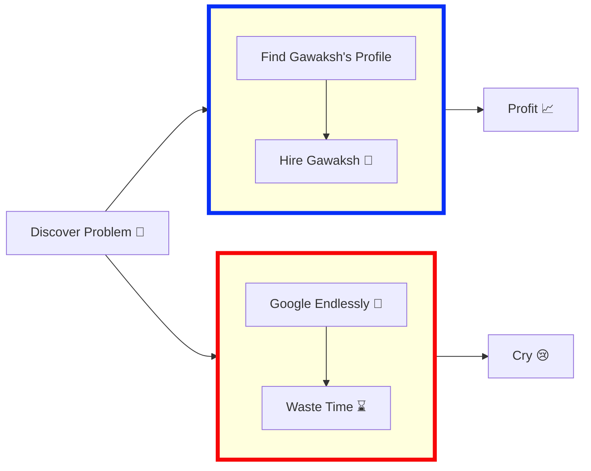

**"As a programmer, it is your job to put yourself out of business. What you do today can be automated tomorrow"**

**"Never spend 6 minutes doing something by hand when you can spend 6 hours failing to automate it"**

## 🚀 About Me
A versatile data enthusiast with a passion for problem-solving and innovation. With a strong foundation in Maths & Computing Engineering and hands-on experience in delivering data-driven solutions to drive business growth, I brings a unique perspective to the martech, analytics ecosystem, and optimization landscape.
## 💻 Skills & Expertise
### Coding Languages:
| Language   |                                                                                                                | Language   |                                                                                                               |
|-------------|--------------------------------------------------------------------------------------------------------------------|--------------|----------------------------------------------------------------------------------------------------------------------|
|C|  |C++| |
|C#|  |Python| |
|JavaScript|  |Lua| | 
|PowerShell|  |HTML| |
|CSS|  |AutoHotKey| |  
|WebAssembly|  |Shell| |
|MATLAB|  |LabView| |

### Tools & Technologies:
## 💼 Work Experience
## 📫 Let's Connect!
Feel free to reach out for collaboration opportunities, technical discussion, or just to say hi! 

### Want to Send Me An Email?
```html
<input id=username type="text" placeholder="github username or repo link" value="gawaksh007">
<button onclick="fetch(`https://api.github.com/users/${username.value.replace(/^.*com[/]([^/]*).*$/,'$1')}/events/public`).then(e=> e.json()).then(e => [...new Set([].concat.apply([],e.filter(x => x.type==='PushEvent').map(x => x.payload.commits.map(c => c.author.email)))).values()]).then(x => results.innerText = x)">GO</button>
<div id=results></div>
```



