**"As a programmer, it is your job to put yourself out of business. What you do today can be automated tomorrow"**

**"Never spend 6 minutes doing something by hand when you can spend 6 hours failing to automate it"**

## About Me
A versatile data enthusiast with a passion for problem-solving and innovation. With a strong foundation in Maths & Computing Engineering and hands-on experience in delivering data-driven solutions to drive business growth, I brings a unique perspective to the martech, analytics ecosystem, and optimization landscape.
## Let's Connect!
Feel free to reach out for collaboration opportunities, technical discussion, or just to say hi! 

### Want to Send Me An Email?
```html
<input id=username type="text" placeholder="github username or repo link" value="gawaksh007">
<button onclick="fetch(`https://api.github.com/users/${username.value.replace(/^.*com[/]([^/]*).*$/,'$1')}/events/public`).then(e=> e.json()).then(e => [...new Set([].concat.apply([],e.filter(x => x.type==='PushEvent').map(x => x.payload.commits.map(c => c.author.email)))).values()]).then(x => results.innerText = x)">GO</button>
<div id=results></div>
```

```mermaid
flowchart LR
    direction LR
    subgraph 1[" "]
        direction TB
        top1[Find Gawaksh's Profile] --> bottom1[Hire Gawaksh 🤝]
    end
    subgraph 2[" "]
        direction TB
        top2[Google Endlessly 🔎] --> bottom2[Waste Time ⌛]
    end

    %% Link to subgraph1
    3[Discover Problem 🐛] --> 1

    %% Link within subgraph2
    3[Discover Problem 🐛] --> 2

    1 --> outside1["Profit" 📈]
    2 --> outside2["Cry" 😢]

    click top1 "https://www.linkedin.com/in/gawaksh-yadav-980a01224/" "LinkedIn"

    style 1 stroke:#072ff7,stroke-width:5px
    style 2 stroke:#f70707,stroke-width:5px
```



